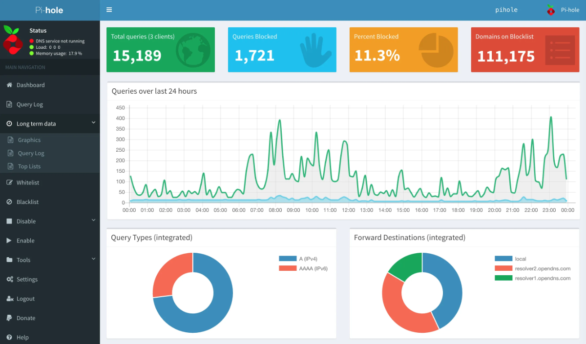

<!--
To README zostało automatycznie wygenerowane przez <https://github.com/YunoHost/apps/tree/master/tools/readme_generator>
Nie powinno być ono edytowane ręcznie.
-->

# Pi-hole dla YunoHost

[](https://ci-apps.yunohost.org/ci/apps/pihole/)


[](https://install-app.yunohost.org/?app=pihole)

*[Przeczytaj plik README w innym języku.](./ALL_README.md)*

> *Ta aplikacja pozwala na szybką i prostą instalację Pi-hole na serwerze YunoHost.*  
> *Jeżeli nie masz YunoHost zapoznaj się z [poradnikiem](https://yunohost.org/install) instalacji.*

## Przegląd

The Pi-hole® is a DNS sinkhole that protects your devices from unwanted content without installing any client-side software.

**Dostarczona wersja:** 6.0.3~ynh1

## Zrzuty ekranu



## :red_circle: Niepożądane funkcje

- **Package not maintained**: This YunoHost package is not actively maintained and needs adoption. This means that minimal maintenance is made by volunteers who don't use the app, so you should expect the app to lose reliability over time. You can [learn how to package](https://yunohost.org/packaging_apps_intro) if you'd like to adopt it.

## Dokumentacja i zasoby

- Oficjalna strona aplikacji: <https://pi-hole.net/>
- Oficjalna dokumentacja dla administratora: <https://docs.pi-hole.net>
- Repozytorium z kodem źródłowym: <https://github.com/pi-hole/pi-hole>
- Sklep YunoHost: <https://apps.yunohost.org/app/pihole>
- Zgłaszanie błędów: <https://github.com/YunoHost-Apps/pihole_ynh/issues>

## Informacje od twórców

Wyślij swój pull request do [gałęzi `testing`](https://github.com/YunoHost-Apps/pihole_ynh/tree/testing).

Aby wypróbować gałąź `testing` postępuj zgodnie z instrukcjami:

```bash
sudo yunohost app install https://github.com/YunoHost-Apps/pihole_ynh/tree/testing --debug
lub
sudo yunohost app upgrade pihole -u https://github.com/YunoHost-Apps/pihole_ynh/tree/testing --debug
```

**Więcej informacji o tworzeniu paczek aplikacji:** <https://yunohost.org/packaging_apps>
